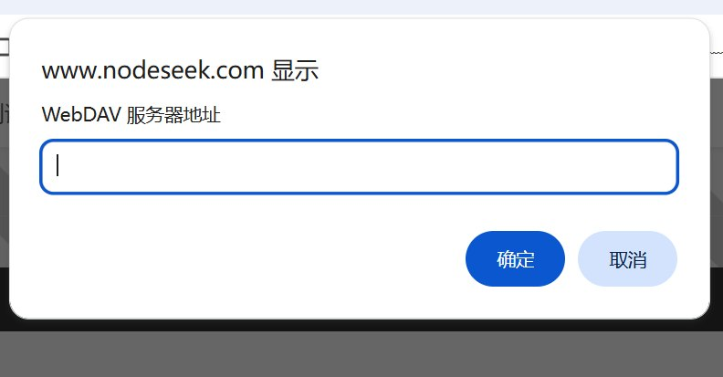
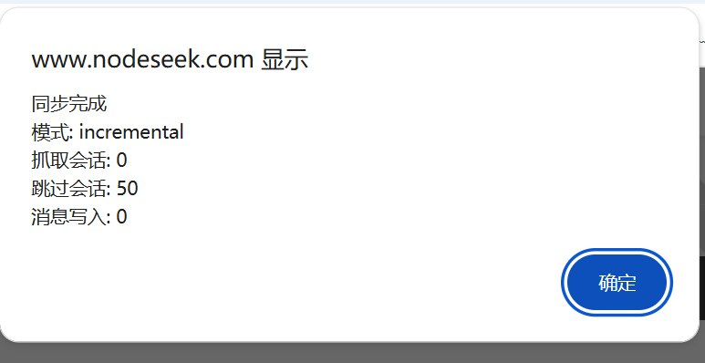
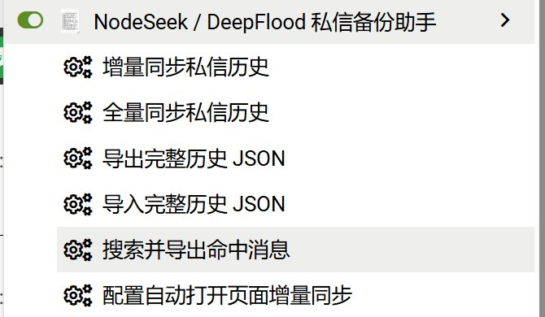

# nfpm

NodeSeek / DeepFlood 私信备份助手。

## 这是什么

这是一个 Tampermonkey 用户脚本，用来把 NodeSeek / DeepFlood 私信完整备份到浏览器本地，并支持导出、导入、WebDAV 备份、页面内查看历史记录。

它的核心目标是解决原版 `likesrt/ns-df-chat-backup` 更偏“聊天列表快照”而不是“完整私信历史”的问题。

这个版本改成了：

- 以 `message_id` 为主键保存消息
- 每条私信单独入库，不再被同联系人后来的消息覆盖
- 支持完整历史同步
- 支持页面内查看本地历史私信
- 支持页面内配置 WebDAV 和自动增量同步
- 支持完整历史 JSON 导出 / 导入

## 支持站点

- NodeSeek
- DeepFlood

## 安装

1. 安装 Tampermonkey
2. 新建脚本
3. 粘贴 `ns-df-chat-full-history.user.js` 的内容
4. 保存并启用脚本
5. 打开私信页面：
   - `https://www.nodeseek.com/notification`
   - `https://www.deepflood.com/notification`

## 现在怎么用

这版已经基本改成**页面内按钮操作**，不需要总去 Tampermonkey 菜单里点。

### 页面截图

#### 页面入口

#### 同步与备份设置

#### 自动同步静默执行示意

进入私信列表页后，页面上会出现 3 个入口：

1. `历史私信`
2. `同步与备份设置`
3. `更多操作`

---

## 1) 历史私信

点击 `历史私信` 后，会打开一个页面内历史面板。

当前支持：

- 查看本地已备份的会话列表
- 点击联系人查看消息历史
- 在面板内按关键词搜索本地私信
- 在左侧筛选联系人 / 最后一条消息

这个面板展示的是**浏览器本地 IndexedDB 里的备份数据**，不是远程实时接口。

---

## 2) 同步与备份设置

点击 `同步与备份设置` 后，会打开一个统一设置弹窗。

### 里面可以做什么

#### WebDAV 配置
一次填写：

- WebDAV 服务器地址
- 用户名
- 密码
- 备份路径

#### 自动增量同步
可以设置：

- 是否启用“打开私信列表页时自动增量同步”
- 最短触发间隔（分钟）

#### 最近一次同步记录
会显示：

- 时间
- 模式
- 抓取会话数
- 跳过会话数
- 消息写入数

#### 立即执行一次增量同步
不想等自动触发时，可以直接点：

- `立即执行一次增量同步`

#### WebDAV 备份
当前 `WebDAV备份` 按钮会使用这里保存的配置进行备份。
如果没有配置过，会先要求你填写设置。

---

## 3) 更多操作

点击 `更多操作` 后，会打开一个小窗口。

当前保留这几个操作：

- `增量同步私信历史`
- `全量同步私信历史`
- `导出完整历史 JSON`
- `导入完整历史 JSON`

### 这些操作分别是什么意思

#### 增量同步私信历史
只同步有变化的会话。
适合日常使用。

#### 全量同步私信历史
重新逐个联系人完整抓一次。
适合第一次使用，或者怀疑本地数据不完整时。

#### 导出完整历史 JSON
把当前浏览器本地库里的完整历史导出成一个 JSON 文件。
适合备份、迁移、后续导库。

#### 导入完整历史 JSON
把之前导出的完整历史 JSON 重新导入当前浏览器本地库。
适合换浏览器、清空本地后恢复、迁移数据。

---

## 数据存到哪里

默认保存在**当前浏览器本地 IndexedDB**。

也就是说：

- 不会自动上传到 NodeSeek / DeepFlood 服务器
- 不会自动上传到 GitHub
- 不会自动写进远程数据库

只有当你主动配置并执行 WebDAV 备份时，才会上传到你的 WebDAV。

---

## 自动增量同步说明

如果你在“同步与备份设置”里开启了自动增量同步，那么：

- 打开私信列表页时
- 脚本会检查距离上次自动运行是否超过你设置的间隔
- 如果超过，就自动执行一次增量同步

现在自动增量同步是**静默执行**的：

- 不会每次都弹“同步完成”确认框
- 最近同步结果会显示在“同步与备份设置”里

---

## WebDAV 备份说明

当前支持 WebDAV 手动备份。

特点：

- 如果目录不存在，会尝试逐级创建目录
- 已处理常见的 `409 Conflict` 目录问题
- 使用的是你在“同步与备份设置”里保存的配置

常见 WebDAV 服务都可以试：

- 坚果云
- Nextcloud
- 其他标准 WebDAV 服务

---

## 适合的使用顺序

### 第一次使用

1. 打开私信页
2. 点 `更多操作`
3. 先执行 `全量同步私信历史`
4. 再点 `导出完整历史 JSON`
5. 如果要云端备份，再进 `同步与备份设置` 配 WebDAV

### 日常使用

- 开启自动增量同步
- 平时直接看 `历史私信`
- 需要时手动导出 JSON
- 或备份到 WebDAV

---

## 当前功能状态

已完成：

- 完整历史数据模型（`message_id` 主键）
- `dialogs` + `messages` 双存储
- 增量同步 / 全量同步
- 断点续跑
- 完整历史 JSON 导出 / 导入
- WebDAV 手动备份
- 页面内历史私信面板
- 页面内统一设置弹窗
- 页面内操作小窗口
- 自动打开页面增量同步
- 最近一次同步记录展示

还可继续增强：

- 更像聊天软件的 UI 样式
- 搜索结果高亮 / 定位到具体消息
- 云端备份列表 / 恢复
- 更细粒度的增量策略
- 更好的大数据量性能优化

## 文件

- `ns-df-chat-full-history.user.js`：主脚本
